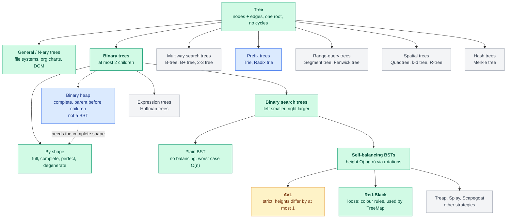
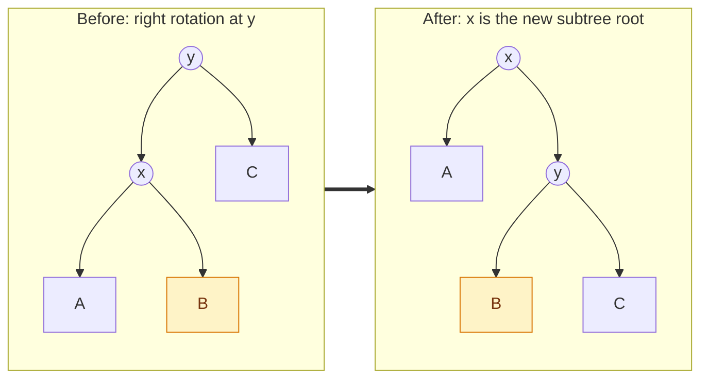

# Trees — Reference

The quick-reference version of tree data structures: for each topic, the problem it
solves, the core idea, the key facts and the numbers. The full explanations (worked
examples, code, pseudocode, why-it-works reasoning and check-yourself questions) are
in the deep-dive companion, [trees-notes.md](../notes/trees-notes.md). Every section
below ends with a **Deep-dive** link.

**Progress**

| # | Topic | State |
|---|---|---|
| 1–2 | Tree basics, binary trees, balanced trees | ✅ read |
| 3 | BST | ✅ read |
| 4–5 | Rotations; Red-Black tree (rules, recolouring) | ✅ read |
| 6 | Traversals (recursive + stack) | ✅ read |
| 7 | `TreeMap` / `TreeSet` vs `HashMap` | ✅ read |
| 8 | AVL: balance factor | ✅ read |
| 8 | AVL: pseudocode | 📖 reading now |
| 10 | Heaps / `PriorityQueue` | ⏭️ next, in [its own files](heaps.md) |
| 11 | Trie | ⏭️ next |
| — | Gaps worth adding ([section 12](#12-topics-not-yet-on-the-list)) | 💡 suggested |

## The map of trees

Each level down adds one rule. ✅ = read · 📖 = reading now · ⏭️ = next · 💡 = suggested.



Legend: 🟩 read · 🟨 reading now · 🟦 next · ⬜ suggested for later.

<details>
<summary>Plain-text version</summary>

```
TREE  (nodes + edges, one root, no cycles)                       ✅
├── General / N-ary trees ........ file systems, org charts, DOM
├── BINARY TREES  (≤ 2 children)                                 ✅
│   ├── by shape .................. full · complete · perfect · degenerate
│   ├── BINARY SEARCH TREES  (left < node < right)               ✅
│   │   ├── Plain BST ............. no balancing, worst case O(n)
│   │   └── SELF-BALANCING BSTs  (height O(log n), via rotations) ✅
│   │       ├── AVL ............... strict (heights differ ≤ 1)   📖
│   │       ├── Red-Black ......... loose (colour rules); TreeMap ✅
│   │       └── Treap · Splay · Scapegoat ... other strategies   💡
│   ├── BINARY HEAP (complete, parent ≤ children; not a BST)     ⏭️
│   └── Expression trees · Huffman trees                         💡
├── MULTIWAY SEARCH TREES ........ B-tree · B+ tree (DB indexes) 💡
├── PREFIX TREES ................. Trie · Radix trie             ⏭️
├── RANGE-QUERY TREES ............ Segment tree · Fenwick tree   💡
├── SPATIAL TREES ................ Quadtree · k-d · R-tree       💡
└── HASH TREES ................... Merkle tree                   💡
```

</details>

"Balanced" is a *property*, not a type: AVL and Red-Black are two answers to how
strictly to hold the height down. A heap is complete but **not** BST-ordered, so it is
a sibling of the BSTs, not a child. B-trees are the balanced-search idea widened for
disks.

> Deep-dive: [the full map, how to read it, and a decision flow](../notes/trees-notes.md#the-map-how-all-the-trees-relate)

## Contents

1. [What a tree is](#1-what-a-tree-is)
2. [Binary trees and balance](#2-binary-trees-and-balance)
3. [Binary search tree](#3-binary-search-tree)
4. [Rotations](#4-rotations)
5. [Red-Black tree](#5-red-black-tree)
6. [Traversals](#6-traversals)
7. [TreeMap and TreeSet](#7-treemap-and-treeset)
8. [AVL tree](#8-avl-tree)
9. [AVL vs Red-Black](#9-avl-vs-red-black)
10. [Heaps (moved to their own notes)](#10-heaps-moved)
11. [Tries (preview)](#11-tries-preview)
12. [Topics not yet on the list](#12-topics-not-yet-on-the-list)
13. [Quick decision guide](#13-quick-decision-guide)

---

## 1. What a tree is

**Problem:** hierarchical data (folders, org charts, HTML) does not fit a flat list.
**Idea:** nodes joined by edges, with one **root**, exactly **one parent** per other
node, and **no cycles**.

| Term | Meaning |
|---|---|
| Root / leaf | No parent / no children |
| Depth (node) | Edges from the root down to it (root = 0) |
| Height (node) | Edges on the longest path down to a leaf (leaf = 0) |
| Height (tree) | Height of the root |
| Subtree | A node plus all its descendants |

`n` nodes ⇒ `n − 1` edges; exactly one path between any two nodes. Height may be
counted in nodes or edges depending on the book; don't mix them.

> Deep-dive: [vocabulary, facts and pictures](../notes/trees-notes.md#1-what-a-tree-is)

---

## 2. Binary trees and balance

**Problem:** unrestricted child counts are awkward. **Idea:** at most two children
(`left`, `right`).

| Shape | Definition |
|---|---|
| Full | Every node has 0 or 2 children |
| Complete | All levels full except maybe the last, filled left to right (heaps) |
| Perfect | All leaves at the same depth; `2^(h+1) − 1` nodes |
| Degenerate | One child per node: a linked list |

Search cost is the **height**: ~20 steps for a million nodes if balanced, a million
if degenerate. A *balanced tree* keeps height `O(log n)` automatically:

| Scheme | Guarantee |
|---|---|
| AVL | Subtree heights differ by ≤ 1 at every node |
| Red-Black | Longest path ≤ 2 × shortest |
| B-tree | All leaves at the same depth (wide nodes, for disks) |

**Why log n:** a perfect tree of height `h` has `2^(h+1) − 1` nodes, so `h ≈ log₂ n`
and **doubling the nodes adds one level** (1,000 → ~10, 1 million → ~20, 1 billion →
~30). Every operation walks one path, so cost = `O(height)`: `O(log n)` if balanced,
`O(n)` if degenerate. Balancing exists to keep the height near `log n`.

> Deep-dives: [the shapes and why height is everything](../notes/trees-notes.md#2-binary-trees-and-why-shape-matters) ·
> [why searches take log n steps](../notes/trees-notes.md#why-searches-take-log-n-steps)

---

## 3. Binary search tree

**Problem:** sorted arrays search fast but insert slowly; linked lists the reverse.
**Idea:** left subtree smaller, right subtree larger, at every node, so each step
discards a whole side.

| Operation | Average | Worst (skewed) |
|---|---|---|
| Search / insert / delete | `O(log n)` | `O(n)` |
| Min / max | `O(h)` | `O(n)` |
| In-order traversal | `O(n)`, **sorted output** | `O(n)` |

Delete: leaf (remove) · one child (replace with the child) · two children (copy the
in-order successor, then delete it). **Catch:** shape depends on insertion order;
sorted input builds a chain.

> Deep-dive: [search, insert, the three delete cases](../notes/trees-notes.md#3-binary-search-tree)

---

## 4. Rotations

**Problem:** reshape a BST without breaking its ordering. **Idea:** a local pointer
swap that moves heights but keeps the in-order sequence (`A < x < B < y < C`). `O(1)`.
Only the middle subtree `B` changes parent. Shared by AVL, Red-Black, treaps, splay
trees.



A, B and C are whole subtrees. **B (amber) is the only one that changes parent**: it
moves from `x` to `y`. The order `A < x < B < y < C` is the same before and after. A
left rotation is the mirror image.

> Deep-dive: [the picture, code and why order survives](../notes/trees-notes.md#4-rotations)

---

## 5. Red-Black tree

**Problem:** AVL's strict balance costs many rotations. **Idea:** a colour bit per
node plus rules that make the tree *roughly* balanced.

1. Every node is red or black.
2. The root is black.
3. NIL leaves are black.
4. A red node has no red child.
5. Every path to a NIL leaf has the same number of black nodes.

Rules 4 + 5 ⇒ longest path ≤ 2 × shortest ⇒ `height ≤ 2·log₂(n+1)`.

**Insert** a red node, then: **red uncle → recolour (may cascade up); black uncle →
rotate (finishes).** At most 2 rotations on insert, 3 on delete. **Trade-off:** looser
than AVL (slightly slower reads), fewer rotations, fiddlier code.

**The four nodes in every fix-up:** **N** the node being fixed, **P** its parent, **G**
its grandparent, **U** its uncle (P's sibling). Same side as its parent ⇒ *line*
(outer); opposite side ⇒ *triangle* (inner). U decides everything: a red U can be
recoloured away (P and U black, G red), a black or missing U forces a rotation.

> Deep-dives: [parent, grandparent and uncle](../notes/trees-notes.md#parent-grandparent-and-uncle) ·
> [why the rules bound the height](../notes/trees-notes.md#why-the-rules-bound-the-height) ·
> [insertion cases and a worked example](../notes/trees-notes.md#how-insertion-works) ·
> [deletion at a glance](../notes/trees-notes.md#deletion-at-a-glance)

---

## 6. Traversals

**Problem:** a tree has no built-in order. **Idea:** DFS (deep first; three variants)
or BFS (level by level).

| Order | Visit | Use |
|---|---|---|
| Pre-order | node, left, right | Copy / serialize |
| **In-order** | left, node, right | **Sorted output of a BST** |
| Post-order | left, right, node | Delete; compute sizes/heights |
| Level-order | by level, with a queue | Shortest path (unweighted); print by level |

Recursive: `O(n)` time, `O(h)` stack (`O(n)` and `StackOverflowError` risk when
skewed). **DFS ↔ stack, BFS ↔ queue.**

**What the names mean:** *pre* / *in* / *post* say when the **node** is visited
relative to its two subtrees: before (parent first, top-down: copy, serialize),
between (smaller, me, larger: sorted output) or after (children first, bottom-up:
heights, sizes, delete). The root is first in pre-order and last in post-order.
Recursion is one stack frame per ancestor still waiting; the iterative versions keep
those ancestors in your own stack. Each node is pushed and popped once, so `O(n)` time,
`O(h)` space.

> Deep-dives: [what each order means, with positions for every node](../notes/trees-notes.md#what-each-order-means) ·
> [recursion](../notes/trees-notes.md#how-recursion-does-it) ·
> [the call stack, traced](../notes/trees-notes.md#watching-the-recursion-the-call-stack) ·
> [iterative versions](../notes/trees-notes.md#how-the-iterative-version-works) ·
> [stack tables for the iterative versions](../notes/trees-notes.md#tracing-the-iterative-versions)

---

## 7. TreeMap and TreeSet

**Problem:** `HashMap` has no order and cannot do range or nearest-key queries.
**Idea:** `TreeMap` is a **Red-Black tree** keyed by `Comparable`/`Comparator`;
`TreeSet` wraps a `TreeMap`.

| | `HashMap` | `TreeMap` |
|---|---|---|
| get / put / remove | `O(1)` average | **`O(log n)` guaranteed** |
| Iteration order | None | **Sorted** |
| Null key | One allowed | Not with natural ordering |
| Key needs | `equals` + `hashCode` | `Comparable` / `Comparator` consistent with `equals` |
| `floor` / `ceiling` / `subMap` | No | **Yes** |

**Default to `HashMap`;** use `TreeMap` for sorted keys, ranges, or nearest-key
lookups. Not thread-safe (`ConcurrentSkipListMap` is the concurrent sorted map).
`HashMap` itself treeifies a bucket of ≥ 8 entries into a Red-Black tree.

**Inside `TreeMap`:** the tree's nodes are instances of a nested `Entry<K,V>` class with
`key`, `value`, `left`, `right`, `parent` and a `color` bit; the map itself holds just
`root`, `size` and the `comparator`. The `parent` pointer serves the Red-Black fix-up
and lets iteration find each in-order successor without a stack.

| Operation | Cost |
|---|---|
| `get` / `containsKey` / `put` / `remove` | **`O(log n)`** (one root-to-node path, ≤ ~2 log₂ n) |
| `firstKey` / `lastKey` / `floorKey` / `ceilingKey` | `O(log n)` |
| Iterate everything **in sorted order** | **`O(n)`**, no sorting step |
| Build by `n` `put`s | `O(n log n)` |

Order is *maintained* a little at each write (that is the `O(log n)`), so sorted reads
are free; with a `HashMap` you would sort, `O(n log n)`, on every read. Each comparison
costs more for long keys (`O(k log n)` for strings of length `k`).

> Deep-dives: [the `Entry` class, search and successor code](../notes/trees-notes.md#inside-treemap-the-entry-class) ·
> [complexity of search and ordering](../notes/trees-notes.md#complexity-of-search-and-ordering) ·
> [navigation API](../notes/trees-notes.md#what-only-a-tree-can-do) ·
> [when to choose it](../notes/trees-notes.md#when-to-choose-it) ·
> [gotchas](../notes/trees-notes.md#gotchas) ·
> [trees inside HashMap](../notes/trees-notes.md#a-fun-fact-that-ties-it-together)

---

## 8. AVL tree

**What:** a BST that keeps itself balanced by rotating after every insert and delete.
**Problem:** a plain BST degrades to `O(n)` on sorted input.

**The rule:** at **every** node, `balance factor = height(left) − height(right)` must
be **−1, 0 or +1**. ±2 ⇒ rotate. Height ≤ ~`1.44·log₂ n` ⇒ `O(log n)` worst case.

| Case | Extra height in | Fix |
|---|---|---|
| Left-Left | left child's left | Right rotate |
| Right-Right | right child's right | Left rotate |
| Left-Right | left child's right | Left rotate the child, then right rotate |
| Right-Left | right child's left | Right rotate the child, then left rotate |

Straight line ⇒ one rotation; elbow ⇒ two. **Insert needs at most one rebalance;
delete can need `O(log n)`.** Rotations must update heights (demoted node first).
**Trade-off:** extra height field and some rotation work, in exchange for the
shallowest tree.

> Deep-dives: [the rule and why it gives O(log n)](../notes/trees-notes.md#the-one-rule) ·
> [the four cases](../notes/trees-notes.md#the-four-imbalance-cases) ·
> [pseudocode](../notes/trees-notes.md#pseudocode) ·
> [worked examples](../notes/trees-notes.md#worked-example-insert-10-20-30-rr) ·
> [complexity](../notes/trees-notes.md#complexity) ·
> [check-yourself questions](../notes/trees-notes.md#check-your-understanding-7)

---

## 9. AVL vs Red-Black

| | AVL | Red-Black |
|---|---|---|
| Balance | Strict | Loose |
| Height | ≈ 1.44 log n | ≈ 2 log n |
| Lookups | **Faster** | Slightly slower |
| Insert / delete | More rotations | **Fewer rotations** |
| Extra storage | height per node | 1 colour bit |
| Used in | Read-heavy in-memory indexes | `TreeMap`, C++ `std::map`, Linux scheduler |

**AVL optimises reads, Red-Black optimises writes; both are `O(log n)`.**

> Deep-dive: [why the difference exists](../notes/trees-notes.md#9-choosing-between-avl-and-red-black)

---

## 10. Heaps (moved)

Heaps now have their own files: a heap is stored in an array, keeps only the min or max
at the top, and uses sift up / sift down instead of rotations. It sits beside the BSTs
on the map, not under them.

> Reference: [heaps.md](heaps.md) · Deep-dive: [heaps-notes.md](../notes/heaps-notes.md)

---

## 11. Tries (preview)

*Not yet read.* **Problem:** prefix queries ("all words starting with `ca`") force a
scan in hash maps and BSTs. **Idea:** store a string one character per step along a
path, with an "end of word" flag; shared prefixes share the path.

`insert` / `search` / `startsWith` are all **`O(L)`** in the word length, independent of
dictionary size. **Trade-off:** memory-hungry; fixed by hash-map children or
compressed (radix) tries. Uses: autocomplete, spell check, IP routing.

> Deep-dive: [code, search vs startsWith, trade-offs](../notes/trees-notes.md#11-tries-preview)

---

## 12. Topics not yet on the list

Ordered by how likely they are to matter for a backend / architect track and interviews.

**High value**

1. **B-tree and B+ tree** — the structure behind almost every database index; wide
   nodes ⇒ shallow trees ⇒ few disk reads. Ties into
   [Data architecture](../data/data-architecture.md) (B-tree vs LSM indexes).
2. **Classic tree problems** — height, diameter, validate BST, lowest common ancestor,
   zig-zag, path sum, serialize/deserialize, build from pre-order + in-order, kth
   smallest in a BST, invert, balanced check.
3. **N-ary trees** — file systems, org charts, the DOM, JSON/XML.
4. **Graph traversal** — tree DFS/BFS is the cycle-free special case; the natural next
   step.

**Medium value**

5. **Segment tree / Fenwick tree** — range queries with point updates in `O(log n)`.
6. **Skip list** — probabilistic alternative to balanced trees; powers
   `ConcurrentSkipListMap` and Redis sorted sets.
7. **Union-Find** — a forest with path compression; connectivity, Kruskal's MST.
8. **Treap, Splay, Scapegoat** — other balancing strategies.

**Low priority / niche**

9. **Merkle tree** — Git, blockchains, Cassandra anti-entropy, Dynamo.
10. **R-tree / quadtree / k-d tree** — spatial indexing (see the dispatch example in
    [System design — worked examples](../architecture/system-design-worked-examples.md)).
11. **Suffix tree / array**, **Huffman tree**, **threaded trees**.

**Suggested order:** AVL pseudocode → heaps → trie → classic problems → B/B+ tree →
segment tree / Fenwick → Merkle / skip list.

---

## 13. Quick decision guide

| I need… | Use |
|---|---|
| Fast key lookup, no order | `HashMap` |
| Sorted keys / ranges / floor-ceiling | `TreeMap` (Red-Black) |
| Always the smallest/largest next | `PriorityQueue` (heap) |
| Prefix search / autocomplete | Trie |
| Read-heavy ordered in-memory index, hand-rolled | AVL |
| Ordered index on disk | B+ tree (section 12) |

> Check-yourself questions sit at the end of every section in
> [trees-notes.md](../notes/trees-notes.md).
