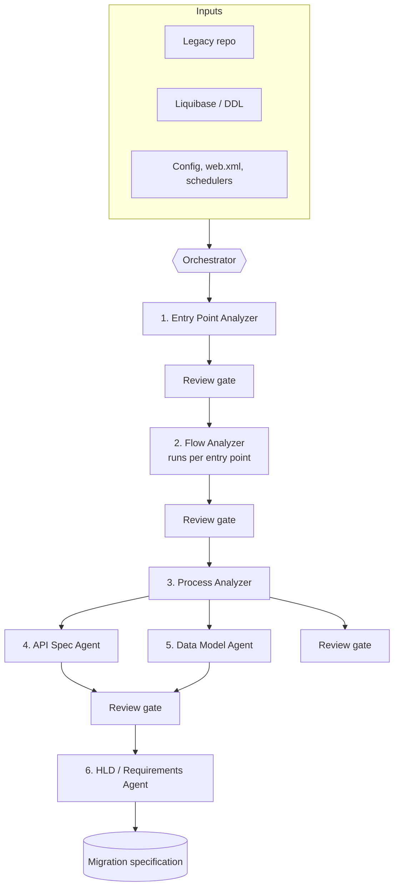
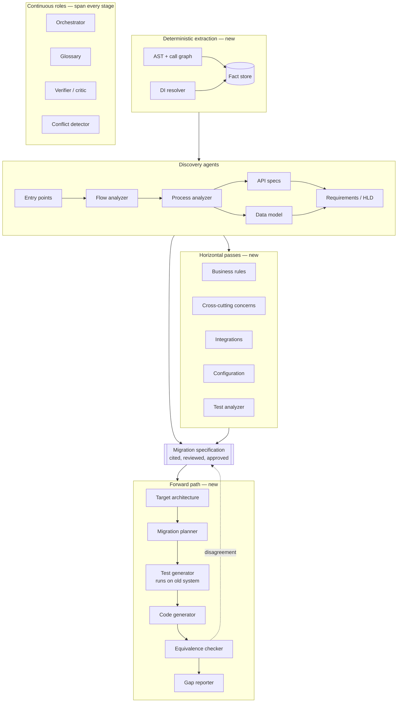

# Agentic Reverse-Engineering Pipeline — Design Notes & Interview Prep

A working reference for describing the legacy-to-modern migration platform in interviews.

---

## 1. The story in three lengths

**One line**
"We built an agentic system that reads a legacy codebase and produces the documentation you'd need to rebuild it — entry points, flows, processes, API specs, data model, and a consolidated requirements document."

**30 seconds**
"Migration projects stall because nobody knows what the old system actually does. The documentation is gone and the people who wrote it have left. We built a pipeline of specialised agents that reverse-engineers the code into layered documents — starting from entry points, then flows, then business processes, then contracts. Each agent produces one reviewable artifact, and a human signs off before the next stage runs. The output becomes the specification for the rewrite."

**90 seconds — add the *why it's designed this way***
"The obvious approach is to throw the repo at a model and ask for documentation. That fails for two reasons: the codebase doesn't fit in context, and you can't review a wall of generated text you don't trust.

So we inverted it. Instead of one big summarisation problem, we made it a staged pipeline where each stage has a narrow job, a fixed output template, and a tangible artifact. Stage one finds every entry point. Stage two walks each entry point's call flow independently — which means each unit of work is small and bounded, and they run in parallel. Stage three composes those flows upward into business processes. Then API specs, then data model, then the high-level requirements document on top.

I call it bottom-up composition. Context limits stop being a constraint because no agent ever sees the whole system — it only sees the slice it needs plus the artifacts from the stage before. And because every stage emits a document a human can read, we put a review gate at each boundary. That matters, because an error at stage one silently corrupts everything downstream."

---

## 2. Architecture



### Stage table

| # | Agent | Input | Output artifact | Notes |
|---|---|---|---|---|
| 1 | Entry Point Analyzer | Repo, config, annotations | `entry-points.md` — inventory of REST, scheduler, event/pub-sub, MQ listener, remote/RMI/SOAP, CLI, batch | The most leverage-critical stage. A miss here means a whole branch of the system is never documented. |
| 2 | Flow Analyzer | One entry point + its call-graph slice | Per-flow doc: sequence diagram, step narrative, files/classes touched, external calls | **Fan-out.** Runs independently per entry point → parallel, bounded, cheap to retry. |
| 3 | Process Analyzer | All flow docs | Process docs grouped by domain (e.g. Order lifecycle: create → amend → cancel → fulfil) | **Fan-in.** Where technical flows become business meaning. Hardest and fuzziest stage. |
| 4 | API Spec Agent | Flows + entry points | OpenAPI / contract spec | Mostly mechanical; good candidate for a cheaper model. |
| 5 | Data Model Agent | Liquibase/DDL + repository layer from flows | Schema doc, ERD, table-to-process mapping | Liquibase gives ground truth; without it, infer from entities and accept lower confidence. |
| 6 | HLD / Requirements Agent | Everything above | Consolidated high-level requirements document | Composition, not discovery. Should introduce no new facts. |

### Cross-cutting

- **Orchestrator** — owns the DAG, state, checkpoints, retries, and fan-out/fan-in. It is a workflow engine, not a chat loop.
- **Agent contract** — every agent has: role instructions, an output template, tool access, and permission to raise a clarifying question instead of guessing.
- **Human-in-the-loop** — a gate at each stage boundary. Approve, edit, or send back.

---

## 3. The six design principles (the part interviewers actually care about)

**1. Artifacts are the interface, not conversation.**
Agents don't talk to each other. They read and write documents. That gives you resumability (restart from any stage), auditability (diff any artifact), reviewability (a human reads a doc, not a transcript), and it means a stage-2 failure doesn't poison stage 3's context.

**2. Divide to fit context, not just to organise.**
The context window is the binding constraint. Per-entry-point isolation means the unit of work is sized by one call flow, not by the repo. A 2M-line monolith and a 50k-line service run through the same machinery — one just fans out wider.

**3. Every stage lifts the abstraction level.**
Syntax → call flow → business process → contract → requirement. It's a decompiler, but instead of lowering to machine code it lifts toward intent. Each stage is only allowed to reason one level above its input.

**4. Escalate rather than guess.**
Letting agents ask counter-questions is a hallucination control, not a convenience. An agent that flags "this branch depends on a config flag I can't resolve" is worth more than one that invents a plausible answer.

**5. Review earliest, because errors compound.**
Cost of a mistake is proportional to how many downstream stages consume it. Stage 1 review is the highest-value human time in the system.

**6. Tangible output per agent.**
If an agent can't name the file it produces, it shouldn't be a separate agent.

---

## 4. Design details worth being able to defend

### Grounding — how do you know the sequence diagram is real?

This is the question that separates a demo from a system. The strong answer:

> Don't let the model discover facts it can extract deterministically. Use static analysis to build ground truth — AST parsing, call graph, annotation scanning, DI wiring — and let the LLM narrate and interpret that graph rather than infer it from reading files. Every claim in an artifact carries a `file:line` citation so a reviewer can verify in seconds instead of re-reading the code.

Split the work: **deterministic extraction → generative explanation.**

See **Appendix A** for what each of those extraction techniques actually means and how to build the layer.

### Coverage — how do you know you found every entry point?

- Multiple detection strategies in parallel: annotations, XML config, `web.xml`, framework registries, scheduler configs, message listener bindings.
- Reachability check: what percentage of classes are reachable from at least one discovered entry point? The unreachable remainder is either dead code or a missed entry point — and you report it as an open question, not silence.
- Reconcile against runtime evidence where it exists: access logs, APM traces, gateway routes. Anything called in production that isn't in your inventory is a gap.

### Reproducibility

Temperature 0, pinned model version, versioned prompt templates, and every agent's input + output persisted. If a re-run produces a different document, the human review you already paid for is wasted.

### Handling human corrections

A correction at stage 2 has to reach stage 3. Two options, and you should know the trade-off:
- **Re-run downstream** — correct but expensive.
- **Correction memory** — approved edits are injected as authoritative context for later stages. Cheaper, but you need to detect when a correction invalidates something already produced.

Longer term, approved artifacts become few-shot examples that improve the prompts. The review loop pays for itself twice.

### Cost and incremental runs

Per-entry-point cost makes budgeting linear and predictable. For repeat runs, diff against git and only re-analyse flows whose files changed. Prompt caching helps on the shared context (conventions, glossary, framework notes).

### Evaluation

Pick two or three modules your SMEs know cold. Have them write the documentation manually. Compare. Useful metrics:
- Entry point recall (did we find them all?)
- Human edit distance on generated docs — what fraction ships unchanged?
- Time to produce the same artifact manually vs. with the pipeline
- Reviewer-reported factual errors per document

**Appendix B** reworks this properly — most of the output is mechanically checkable, and edit distance is the wrong metric.

---

## 5. Known gaps — name these before the interviewer does

Volunteering limitations reads as seniority. Each one below has a genuine answer attached.

| Gap | Honest response |
|---|---|
| **Bottom-up gives you *what*, not *why*.** A hardcoded 14-day rule looks arbitrary in code. | Bottom-up has to meet top-down. Feed in whatever business context exists — old specs, SME interviews, ticket history — and have the agent mark unexplained rules as open questions for the business, not invent rationale. |
| **Stage 3 (process clustering) is the fuzziest.** "What is a process" is a judgement call. | That's exactly why it's the most heavily reviewed gate. Anchor clustering on domain nouns and shared data entities rather than letting the model free-associate. |
| **Cross-cutting concerns don't fit the flow model.** Security, transactions, caching, error handling live orthogonally. | Handle them as a separate horizontal pass rather than forcing them into per-entry-point flows — see **Appendix C** for the target-state pipeline. |
| **Async and event-driven paths break call-graph tracing.** The chain ends at `publish()`. | Match publishers to subscribers by topic/message type as an explicit reconciliation step; flag unmatched ones. |
| **The docs capture behaviour, including bugs.** | Distinguish observed behaviour from intended behaviour in the template. A faithful bug-for-bug spec is sometimes what you want in a migration — but the decision should be conscious. |
| **Reflection, dynamic dispatch, generated code.** | Static analysis genuinely can't see these. Report them as known blind spots with a coverage number. |

---

## 6. Likely interview questions

### Architecture / system design

1. **Why multiple agents instead of one large prompt?**
   Context limits are the headline reason, but not the only one: specialisation raises quality, tangible artifacts make review possible, failures stay isolated to one stage, and cheap stages can run on cheaper models.

2. **How does the orchestrator work?**
   A DAG with checkpointed state — not a conversational loop. Stage 2 is a map (fan-out per entry point), stage 3 is a reduce. Each node is independently retryable, and the run can resume from the last approved artifact.

3. **What happens when an agent fails or produces garbage?**
   Retry with the same input; if it fails validation twice, escalate to the human with the raw input attached. Because artifacts are the interface, a bad stage-2 output blocks exactly one flow rather than corrupting the run.

4. **How would you scale this to a 2M-line codebase?**
   The fan-out width grows, not the depth. Parallelise stage 2, batch stage 3 by domain, and be honest that the human review capacity becomes the bottleneck long before compute does.

5. **Why bottom-up rather than top-down?**
   Top-down requires knowledge that no longer exists in these projects — that's the premise. Bottom-up starts from the only reliable source of truth: the code.

### LLM / agent-specific

6. **How do you prevent hallucination?**
   Deterministic extraction for facts, LLM for narration. Citations to `file:line`. Fixed output templates that constrain the shape of the answer. Escalation over guessing. Human gates.

7. **How do you handle the context window?**
   Structurally, not with tricks. No agent ever sees the whole system — it sees its slice plus prior artifacts. Prior artifacts are already compressed by design, because each stage's output is a summary of its input.

8. **How do you evaluate a generative system with no single right answer?**
   Golden set against SME-written docs, edit distance on shipped artifacts, entry point recall, error reports from reviewers. Accept that it's a quality-assist metric, not an accuracy metric.

9. **Why the counter-questions feature?**
   It converts silent hallucination into visible uncertainty. That's the single highest-value behaviour in a documentation agent.

10. **What would you do differently now?**
    Have a real answer ready. Candidates: invest in static analysis earlier instead of relying on the model to read files; build the eval harness before the fourth agent, not after; make the review UI a first-class product rather than markdown files in a repo.

### Engineering management (Sabre track)

11. **How did you divide the work across the team?**
    Agents map cleanly onto ownership boundaries — one person per stage, with the artifact schema as the contract between them. Same reason microservices split well.

12. **How did you get buy-in for an unproven approach?**
    Pick one well-understood module, run it end to end, put the output in front of the SMEs who know that module. Trust is earned per artifact, not per pitch.

13. **How did you manage the human reviewers' time?**
    Front-load it at stage 1 where leverage is highest, and treat review throughput as the real capacity constraint in planning.

14. **How do you know this saved money?**
    Compare against the manual baseline for the same module — SME days to produce equivalent documentation. Have the number.

### FDE / client-facing track

15. **How would you deploy this at a client site?**
    Code can't always leave the client's network — so design for on-prem or client-VPC deployment, model-provider flexibility, and no data retention. This is a real differentiator to mention.

16. **How would you adapt it for a different stack?**
    The pipeline shape is stack-agnostic; the static analysis layer and the entry-point detection heuristics are the parts that change. Say which layer is the porting cost.

17. **How do you make a client trust generated documentation?**
    You don't ask them to. You give them citations and a review gate, and let them find that the first module was right.

---

## 7. Numbers you should collect before the interview

Stories land, numbers close. Fill these in:

- Codebase size the pipeline was run against (LOC, modules, services)
- Number of entry points discovered — and how many the team hadn't known about
- Documents generated per run, and total runtime
- Percentage of generated docs accepted with no edits
- Manual baseline: SME-days to document one module by hand
- Team size and your specific scope in it
- Cost per run

If you don't have a metric, say so plainly and give the qualitative version. Inventing a number is the only unrecoverable mistake here.

---

## 8. Questions worth asking your interviewer

- How much legacy surface area is in play, and is anyone documenting it today?
- Where does the organisation sit on running models against proprietary source code?
- Is there an evaluation practice for generative features, or is quality judged by demo?
- Who owns the decision when generated output and SME knowledge disagree?

---

# Appendix A — The static analysis layer

The governing rule: **anything a compiler could tell you, don't ask a model.** Extract it mechanically, store it as facts, hand those facts to the agent to explain.

## A1. The four techniques

### AST parsing

Parse source into a tree instead of reading it as text. You get classes, methods, fields, parameters, inheritance, imports, annotations and call sites — exactly right, every time.

Tools: **JavaParser** (source only, easiest start), **Spoon**, **Eclipse JDT**, **tree-sitter** for multi-language.

The catch: a plain AST is syntax only. It sees `service.process()` but doesn't know the type of `service`. Resolving that needs the classpath — JavaParser's `JavaSymbolSolver`. **The gap between raw syntax and resolved types is the single biggest quality jump in this whole layer.**

### Call graph

Nodes are methods, edges are calls. Built by walking the ASTs with type resolution on.

This is what solves the context problem. Forward-traverse from one entry point and you get the exact set of methods and files it can reach. Bound the traversal by package so you don't descend into JDK and Spring internals. That reachable set is what you hand the Flow Analyzer — not the repo, not a guess.

Hard part is dynamic dispatch. `PaymentProcessor p = ...; p.process()` may land on three implementations. Class Hierarchy Analysis returns all of them, which over-approximates. Tolerable here — showing a reviewer three candidates beats silently missing one — but the agent should say "one of these three" rather than pick.

If the project compiles, bytecode analysis (**Soot**, **WALA**, ASM) is more accurate since types are already resolved. Legacy code often won't build cleanly, so source-level parsing is the safer default.

### Annotation scanning

Most of Stage 1, nearly free.

| Annotation | Gives you |
|---|---|
| `@RestController`, `@GetMapping`, `@PostMapping` | REST entry points + path, verb, params (most of your OpenAPI) |
| `@Scheduled` | Scheduler entry points with cron expression |
| `@KafkaListener`, `@JmsListener`, `@RabbitListener` | Message-driven entry points + topic/queue |
| `@EventListener` | In-process event handlers |
| `@Entity`, `@Table`, `@Column`, `@ManyToOne` | Data model — feeds Stage 5 |
| `@Transactional` | Transaction boundaries |
| `@PreAuthorize`, `@Secured` | Security — a cross-cutting pass |

For genuinely old code the equivalent lives in XML: `web.xml` servlet mappings, Spring XML beans, `struts-config.xml`, EJB descriptors, Quartz configs. Legacy systems are usually more XML than annotation — plan for both from the start.

### DI wiring

The piece models get wrong most often, and it's completely mechanical to resolve.

Problem: `@Autowired private OrderService orderService`. Declared type is an interface. Your call edge points at `OrderService.create()`, which has no body. The flow dead-ends right where it gets interesting.

Fix: build a bean registry. Scan every `@Component`, `@Service`, `@Repository`, `@Configuration` + `@Bean` method, and every XML bean definition. Map each interface to its implementations. One implementation → resolved. Several → check `@Qualifier`, `@Primary`, `@Profile`, conditional beans. Still ambiguous → that's exactly the counter-question the agent should raise instead of guessing.

## A2. How it changes each stage

- **Stage 1** becomes mostly deterministic. Scanner finds entry points; model describes and classifies them.
- **Stage 2** gets a precise file slice and a real call graph. Model narrates the graph into a sequence diagram rather than inventing the edges.
- **Stage 3** stays LLM-heavy — clustering flows into processes needs judgement — but you can hand it a mechanical signal: which flows touch the same entities and tables.
- **Stages 4 and 5** are close to free. Annotations plus Liquibase already contain the answer.

## A3. Declared blind spots

Static analysis genuinely cannot see: reflection, `Class.forName`, dynamic proxies, Spring AOP advice, `ServiceLoader`, string-based routing, and generated code (Lombok, MapStruct, QueryDSL).

Grep for those patterns and report affected files as known gaps with a coverage number. **Naming what you can't see is a strength in review, not a weakness.**

## A4. Building it — Java

**Dependency** (parser + symbol solver in one artifact):

```xml
<dependency>
  <groupId>com.github.javaparser</groupId>
  <artifactId>javaparser-symbol-solver-core</artifactId>
  <version>3.25.10</version>
</dependency>
```

**Parse and look around.** `findAll(Type.class)` is the workhorse — swap in `ClassOrInterfaceDeclaration`, `FieldDeclaration`, `MethodCallExpr`, `AnnotationExpr`:

```java
CompilationUnit cu = StaticJavaParser.parse(new File("OrderController.java"));

cu.findAll(MethodDeclaration.class).forEach(m -> {
    System.out.println(m.getNameAsString()
        + " line " + m.getBegin().map(p -> p.line).orElse(-1)
        + " annotations " + m.getAnnotations());
});
```

**Turn on symbol resolution.** The step that matters — without it, `service.process()` is just two strings:

```java
CombinedTypeSolver solver = new CombinedTypeSolver();
solver.add(new ReflectionTypeSolver());                          // JDK types
solver.add(new JavaParserTypeSolver(new File("src/main/java"))); // your source
for (File jar : dependencyJars) {
    solver.add(new JarTypeSolver(jar));                          // Spring, etc.
}

ParserConfiguration config = new ParserConfiguration()
    .setSymbolResolver(new JavaSymbolSolver(solver))
    .setLanguageLevel(ParserConfiguration.LanguageLevel.JAVA_11);

StaticJavaParser.setConfiguration(config);
```

Getting the jars matters more than it looks. Run `mvn dependency:build-classpath -Dmdep.outputFile=cp.txt` and feed that list in. Skip it and half your resolutions fail.

**Extract call edges.** Wrap every `resolve()` — it will fail on generics edge cases, missing jars, genuinely dynamic code. Log those rather than letting them kill the run; the unresolved count is a useful quality metric:

```java
cu.findAll(MethodCallExpr.class).forEach(call -> {
    try {
        ResolvedMethodDeclaration target = call.resolve();
        System.out.println("CALLS " + target.getQualifiedSignature()
            + " at line " + call.getBegin().map(p -> p.line).orElse(-1));
    } catch (UnsolvedSymbolException | UnsupportedOperationException e) {
        System.out.println("UNRESOLVED " + call.getNameAsString());
    }
});
```

To know which method a call sits inside: `call.findAncestor(MethodDeclaration.class)`.

**Whole project.** Use `tryToParse()`, not `parse()` — legacy repos always have files that won't parse and you don't want one stopping everything:

```java
SourceRoot root = new SourceRoot(Paths.get("src/main/java"));
root.getParserConfiguration().setSymbolResolver(new JavaSymbolSolver(solver));
root.tryToParse();

List<CompilationUnit> units = root.getCompilationUnits();
```

**Emit facts, not objects.** Output should be a plain data file the agents read:

```json
{"type":"method","id":"com.acme.OrderService#create(OrderDto)","file":"OrderService.java","line":42,
 "annotations":["Transactional"],"javadoc":"Creates a new order..."}
{"type":"call","from":"com.acme.OrderController#post(OrderDto)",
 "to":"com.acme.OrderService#create(OrderDto)","file":"OrderController.java","line":31}
{"type":"unresolved","from":"com.acme.OrderService#create(OrderDto)","name":"handle","line":58}
```

Load into Neo4j or even SQLite. A reachability query from an entry point then gives you exactly the file slice for the Flow Analyzer.

## A5. Gotchas

- **Set the language level explicitly.** Old code uses `enum`, `assert` or `var` as identifiers; defaults will reject it.
- **Interfaces still dead-end.** Resolution gives you the interface method. Mapping to the implementation is the DI wiring pass — keep them separate.
- **Comments need enabling in some parsers.** JavaParser keeps them by default; JDT needs comment mapping switched on.
- **Lombok is invisible.** Generated getters, setters, builders don't exist in source. Either delombok first or declare the gap.

## A6. Shortcuts if you'd rather not build the resolver

- **jQAssistant** — scans a Java project into a Neo4j graph of classes, methods, calls and annotations. Query in Cypher.
- **Eclipse JDT language server (`jdtls`) headless** — ask it for definitions and references. Compiler-grade accuracy for free, since it's the same engine your IDE uses.

## A7. Javadoc and comments

**Bytecode has no Javadoc.** `javac` treats comments as whitespace for code generation — nothing survives into the `.class` file. Soot, WALA and ASM give you an accurate call graph and zero comments. Another argument for source parsing over bytecode, on top of legacy code often not building cleanly.

**Source-level AST parsing keeps it.** JavaParser's `getJavadoc()` returns a parsed object with description and block tags (`@param`, `@return`, `@throws`) split out. Eclipse JDT has a `Javadoc` AST node. Spoon has `getDocComment()`. javac's own Compiler Tree API exposes `DocTrees` — which is exactly how the `javadoc` tool works.

**Why it matters:** Javadoc is the one place inside the codebase where a developer wrote down *intent*. It's the closest thing to a fix for the "bottom-up gives you what, not why" gap.

Often the more valuable comments aren't Javadoc at all — they're inline, buried mid-method:

```java
// don't apply surcharge for grandfathered accounts — CR-4471
if (account.getCreatedDate().before(CUTOFF)) { ... }
```

That single line explains a business rule no call-graph analysis would recover. Extract **all** comments, not just doc comments, and pull out ticket references, `TODO`, `FIXME`, `@deprecated`, `@since` as their own signals.

**The caveat — treat comments as a different confidence class.** A call edge is verifiable: the code either calls that method or it doesn't. A comment is a claim some developer made, possibly in 2013, possibly before three refactors. Legacy Javadoc is frequently stale, and much of it is IDE-generated noise (`Gets the name. @return the name`).

In your artifacts:

| Class | Source | How it's stated |
|---|---|---|
| **Fact** | AST, call graph | Stated plainly, cited to `file:line` |
| **Claim** | Comments, Javadoc | Marked as such: "the code comment states X" |
| **Contradiction** | Comment vs. behaviour disagree | Flagged for a human — never resolved silently |

That last row is genuinely useful output. A comment that no longer matches the code is either a bug or a business rule that changed without documentation — either way a human should see it before the rewrite.

---

# Appendix B — Evaluating the pipeline

The stock answer ("golden set, edit distance, accept it's a quality metric") is weak. The premise is half wrong, and saying so is the stronger position.

## B1. Most of this output is checkable

"Generative system with no right answer" treats the pipeline as one thing. It isn't:

| Stage | Ground truth? | How to grade |
|---|---|---|
| 1. Entry points | **Yes** — it's a set | Precision / recall / F1 |
| 2. Flows | **Mostly** — a diagram claims specific call edges | Compare claimed edges to the extracted call graph |
| 3. Processes | **No** — genuinely subjective | Preference, not correctness |
| 4. API specs | **Yes** | Diff against annotations; validate against real traffic |
| 5. Data model | **Yes** — Liquibase is the answer key | Schema diff |
| 6. HLD | **Yes, indirectly** — should invent nothing | Attribution check: every claim traces upstream |

Only one stage out of six is truly subjective. That reframes the conversation from "eval is hard" to "eval is hard *here*, mechanical everywhere else."

## B2. The extraction layer is also the grader

The static analysis facts aren't only input to the agents — they're the answer key.

A generated sequence diagram asserts a set of call edges. You already have the real set.

- **Precision** = claimed edges that actually exist. The complement is your literal hallucination rate — measured per document, no human involved.
- **Recall** = real edges that made it into the narrative, allowing for deliberate elision.

This runs on every artifact on every run, not on a sampled golden set. Continuous measurement instead of a periodic audit. Same trick at stage 4 (endpoints vs annotations) and stage 5 (ERD vs DDL).

## B3. Cross-artifact contradiction — free redundancy

Several artifacts are derived independently but describe overlapping reality. API spec says an endpoint takes `OrderDto`; flow doc says the controller receives `OrderRequest`; data model lists a table no flow touches.

Every disagreement is a bug in one of them. No ground truth needed — just two independent derivations. Cheap, automatic, catches exactly what single-document review misses.

## B4. Mutation testing — unlimited ground truth, no SME time

**Lead with this one.** It solves the actual bottleneck.

Inject a known change into the codebase: add an endpoint, change a threshold, delete a branch, rename a queue. Re-run. Did the documentation change, in the right place, in the right way?

You know the answer by construction, so you can generate hundreds automatically. It measures **sensitivity**, which a static golden set can't — a pipeline can score well on a fixed benchmark and stay blind to whole categories of change. Doubles as your regression suite when you change a prompt or model version.

## B5. The task-level metric everything else proxies for

The real question isn't "is this document good" but **"is this document sufficient to rebuild the system."**

- **Reconstruction test** — hand the requirements doc to a developer or a fresh model with no code access. Have them implement one module. Run the legacy test suite against the result. Expensive; do it once, on one module, before scaling.
- **Sufficiency QA** — cheaper, same spirit. Build a question set only someone who understands the system could answer (pull from existing tests, bug tickets, SME interviews). Answer them using the generated docs alone, no code. Score against ground truth from the code. Runs every release.

## B6. Fixing edit distance

Edit distance is a bad metric. A three-word edit correcting a hallucinated business rule matters enormously; reformatting a table matters not at all. Raw edit distance ranks them identically.

Replace it with a **typed error taxonomy** captured at the review gate:

- Hallucinated fact
- Missing content
- Wrong abstraction level
- Misattributed intent
- Cosmetic

Track weighted counts per type. Every reviewer correction becomes a labeled example, so the golden set builds itself instead of being commissioned. That's the flywheel — you're paying for review anyway, so capture the labels.

## B7. Stage 3, where it really is subjective

Don't grade a process decomposition as right or wrong. Two better moves:

- **Establish the ceiling first.** Have three SMEs cluster the same flows independently and measure how much they agree with *each other*. If humans agree only 70% of the time, the model beating that is meaningless and matching it is a success. Most people skip this and then hold the model to a standard no human meets.
- **Pairwise preference, not absolute scores.** Show reviewers two decompositions blind: which would you rather work from? Humans are far more reliable at comparison than scoring.

## B8. Calibration — the metric that pays for itself

Have agents emit a confidence signal, then check whether it's calibrated: when the agent says high confidence, is it right more often?

This matters more than raw accuracy. Calibrated confidence lets you route human review by confidence, and review capacity is the binding constraint on the whole system. A metric that improves review allocation beats one that only describes output quality.

Related cheap signal: run the same input several times with different chunking or ordering. Disagreement between runs doesn't prove error, but it's excellent triage for where to look.

## B9. LLM-as-judge

Use it for one thing: **groundedness** — "is every claim in this document supported by the provided source material?" Narrow enough to be reliable.

Don't use it for "is this a good decomposition." Judges are sycophantic and reward verbosity.

Either way, validate the judge against human labels first and report the agreement. An uncalibrated judge is just a second unverified model.

## B10. The interview answer

> "The premise that there's no right answer is only true for one stage. Entry points, API specs and the data model all have ground truth, so those are precision and recall. Flow diagrams get graded against the call graph we already extracted — the extraction layer doubles as the answer key, which means we measure hallucination rate on every run rather than sampling. For sensitivity we use mutation testing: inject a known change, check the docs move correctly. That gives unlimited labeled data without spending SME time. The genuinely subjective part is process decomposition, and there I'd measure inter-annotator agreement among SMEs first to establish the ceiling, then use blind pairwise preference rather than pretending there's a correct answer. Underneath all of it, the metric that actually matters is whether the doc is sufficient to rebuild the system — which you test by handing it to someone without code access and seeing what they produce."

---

# Appendix C — Extending the pipeline (target state)

## C1. The test for whether an agent deserves to exist

Say this before listing anything. "We added three agents and rejected five" is a stronger answer than "we added twelve."

1. **Does it produce an artifact a human would review on its own?** If its output is only ever read by the next agent, it's a step, not an agent.
2. **Does it need different context?** Same inputs, same knowledge, different phrasing of the task = a prompt section, not an agent.
3. **Would you retry it independently?** If a failure means re-running the neighbour anyway, they're one unit.
4. **Does it reduce total context, or just add a hop?** Every stage costs a serialise/deserialise round trip and a review gate.

Agent count is not a virtue. Reviewable artifacts are.

## C2. Target-state architecture



Three things to note about the shape:

- **The extraction layer sits underneath, not before.** It's a shared service — every agent queries the fact store rather than re-reading source. That's what makes the grounding claim defensible and the evaluation in Appendix B automatic.
- **The horizontal band doesn't lengthen the critical path.** Those five run off artifacts the discovery chain already produced, in parallel. They add review load but no sequential gates — which is why they're the cheapest wins.
- **The forward path is a different product.** Everything above the specification is documentation and delivers value on its own. Everything below is code generation, with a much higher bar for correctness. A team can ship the top half and stop.

The dashed return arrow matters: when old and new behaviour disagree, sometimes the code is wrong and sometimes the spec is.

## C3. Gaps in the current pipeline

| Agent | Why it's needed |
|---|---|
| **Business rule extractor** | The biggest gap. Validation logic, thresholds, eligibility conditions, calculation formulas, state transition constraints — scattered across services and exactly what must survive a migration. Everything else describes *structure*; this describes *policy*. Output is a rules catalogue with `file:line` citations. It's also the artifact a business stakeholder will actually read. |
| **Cross-cutting concerns pass** | Already flagged as a known gap in section 5. Security, transactions, caching, error handling, logging, retries. Runs horizontally across all flows, which is why it doesn't fit the per-entry-point shape. |
| **Integration / dependency mapper** | Everything the system talks to outbound: third-party APIs, databases, queues, file drops, SFTP, mainframe calls. Integrations are usually what makes a rewrite hard, so this feeds migration planning directly. |
| **Configuration / environment analyzer** | Feature flags, profiles, environment-specific behaviour. Legacy systems hide live business logic in config, and code-only analysis misses it entirely. |
| **Test analyzer** | Existing tests are documentation nobody reads. They encode expected behaviour and edge cases as executable claims — often more honest than the comments. Also tells you which areas are safe to change. |

## C4. The forward path

Your pipeline stops at the spec. The migration itself is where the next agents live, and it's what makes the story bigger in an interview.

| Agent | Produces |
|---|---|
| Target architecture designer | Proposed new-stack design mapped to old components |
| Migration planner | Slice and sequence — what moves first, strangler-fig boundaries |
| Test generator | Characterisation tests from documented behaviour, written against the **old** system |
| Code generator | New-stack implementation per component |
| Equivalence checker | Compares old vs new behaviour on the same inputs |
| Gap reporter | What the new implementation doesn't cover yet |

**Emphasise the test generator.** Its tests run against the legacy system first. If they pass on the old code, you've validated the documentation *and* produced your migration safety net in one step. That detail lands well in an interview.

## C5. Structural additions — roles, not stages

These change the system's shape rather than extending the chain.

- **Critic / verifier agents** — paired with a producer: one writes, one checks the output against the source facts. Cheap, and it catches hallucination before a human spends time on it. Highest-value structural addition on the list.
- **Glossary agent, early and continuous** — extracts domain vocabulary and keeps naming consistent across artifacts. Without it, six agents produce six names for the same concept and the final HLD reads like it was written by six people. Which it was.
- **Conflict detector** — finds disagreements between independently derived artifacts. Needs no ground truth, just redundancy you already have (see B3).
- **Router / triage agent** — decides which flows need deep analysis versus shallow. Not everything deserves the full treatment; this is how you control cost on a large repo.

## C6. The ones to reject — and why

Saying this part out loud reads as judgement rather than enthusiasm.

- **A "summarizer" agent** — every stage already summarises. A hop with no artifact.
- **A separate agent per entry point type** (REST agent, Kafka agent, scheduler agent) — same task, different pattern matching. One agent with type-specific templates.
- **A general "quality checker"** — too vague to be reliable. Groundedness checks scoped per artifact type work; a general critic doesn't.
- **A diagram agent separate from the flow agent** — the diagram renders facts the flow agent already holds. Splitting them risks drift between the prose and the picture.

## C7. The real constraint

Every stage adds a review gate, and human review capacity is already the bottleneck — not compute, not context. Ten stages with no reviewers is worse than six with a queue that keeps up.

So: **expand horizontally before vertically.** The cross-cutting pass, business rules, and integrations all run in parallel off artifacts you already have. They don't lengthen the critical path or add sequential gates. That's where the cheap wins are.
