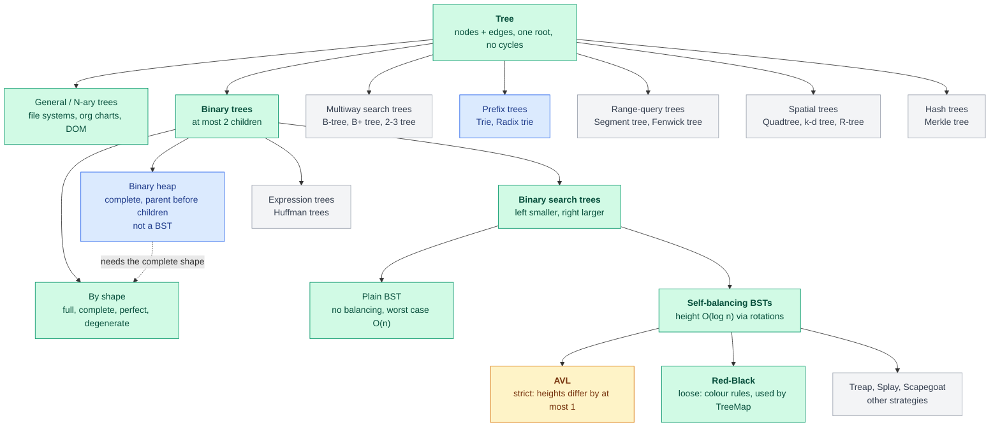

# Trees Notes: From Basics to AVL, Red-Black, Heaps and Tries

Oct 8, 2026 · @Rishabh Toki

The teaching companion to [trees.md](../data-structures/trees.md). Each topic is
explained from first principles in the same order: **the problem** it solves →
**the idea** → **how it works** → **why it works** → **the trade-off**, then a few
questions to check yourself. Code is Java. The concise tables and decision guides
live in the reference note; this file is where the reasoning lives.

**Progress:** ✅ sections 1–7 read · 📖 section 8 (AVL, pseudocode) reading now ·
⏭️ sections 10–11 (heaps, tries) not yet read, so they are previews.

## The map: how all the trees relate

Before the details, here is the whole family. Almost every tree you will meet is a
specialisation of the one above it, so when a new name appears, find it on this map
and ask "what extra rule does it add to its parent?"



Legend: 🟩 read · 🟨 reading now · 🟦 next · ⬜ suggested for later.

<details>
<summary>Plain-text version</summary>

```
TREE  (nodes + edges, one root, no cycles)                         → section 1
│
├── General / N-ary trees   (any number of children)
│     file systems · org charts · the HTML DOM · JSON/XML
│
├── BINARY TREES  (at most 2 children per node)                    → section 2
│   │
│   ├── by SHAPE (describes the form, says nothing about ordering)
│   │     Full · Complete · Perfect · Degenerate
│   │
│   ├── BINARY SEARCH TREES  (left < node < right)                 → section 3
│   │   │
│   │   ├── Plain BST ............ no balancing, worst case O(n)
│   │   │
│   │   └── SELF-BALANCING BSTs  (height guaranteed O(log n))      → section 4
│   │       │                      rebalance with ROTATIONS
│   │       ├── AVL ............... strict: heights differ by ≤ 1       → section 8
│   │       ├── Red-Black ......... loose: colour rules               → section 5
│   │       │                       (used by TreeMap / TreeSet)      → section 7
│   │       └── Treap · Splay · Scapegoat ... other strategies (know they exist)
│   │
│   ├── BINARY HEAP  (complete tree + parent ≤ children; NOT a BST)  → section 10
│   │
│   └── Other binary trees ..... expression trees · Huffman trees
│
├── MULTIWAY SEARCH TREES  (many keys per node, built for disks)
│     B-tree · B+ tree (database indexes) · 2-3 tree                 → 💡 to add
│
├── PREFIX TREES
│     Trie · Radix / Patricia trie                                   → section 11
│
├── RANGE-QUERY TREES
│     Segment tree · Fenwick tree (BIT)                              → 💡 to add
│
├── SPATIAL TREES
│     Quadtree · k-d tree · R-tree                                   → 💡 to add
│
└── HASH TREES
      Merkle tree (Git, blockchains, Dynamo / Cassandra)             → 💡 to add
```

</details>

### How to read the map

- **Going down a branch adds a rule.** A tree becomes a *binary* tree (≤ 2 children),
  then a *binary search* tree (ordered), then a *self-balancing* BST (height
  guaranteed). Each step buys a stronger guarantee and costs more bookkeeping.
- **"Balanced" is not a type of tree, it is a property.** The two balanced BSTs you
  have studied, AVL and Red-Black, are two different answers to the same question:
  *how strictly do we hold the height down?* (Compared in section 9.)
- **Shape and ordering are separate ideas.** "Complete" and "perfect" describe form.
  "BST" describes ordering. A heap is *complete* but **not** ordered like a BST, which
  is why it is a sibling of the BSTs on the map and not a child of them.
- **B-trees are the same idea widened.** A B-tree keeps the "balanced search tree"
  goal but packs many keys per node so a lookup touches few disk pages. That is why it,
  and not AVL or Red-Black, sits under database indexes.
- **Where you are now:** you have finished the BST branch down to Red-Black and are
  in the middle of AVL. Heaps and tries are next; everything marked 💡 is the
  suggested follow-on list in [trees.md](../data-structures/trees.md#12-topics-not-yet-on-the-list).

### The same map as a decision flow

When you meet a problem, ask in this order:

```
Is the data naturally hierarchical?        → a general tree
Do I need to look keys up by value?
  ├── in memory, ordered / range queries   → self-balancing BST   (TreeMap = Red-Black)
  ├── on disk / in a database              → B+ tree
  └── by string prefix                     → trie
Do I only need the min / max repeatedly?   → heap  (PriorityQueue)
Do I need range sums / min over an array?  → segment tree / Fenwick
Do I need to verify or sync big data?      → Merkle tree
```

## Contents

1. [What a tree is](#1-what-a-tree-is)
2. [Binary trees and why shape matters](#2-binary-trees-and-why-shape-matters)
3. [Binary search tree](#3-binary-search-tree)
4. [Rotations](#4-rotations)
5. [Red-Black tree](#5-red-black-tree)
6. [Traversals](#6-traversals)
7. [TreeMap and TreeSet](#7-treemap-and-treeset)
8. [AVL tree](#8-avl-tree)
9. [Choosing between AVL and Red-Black](#9-choosing-between-avl-and-red-black)
10. [Heaps (preview)](#10-heaps-preview)
11. [Tries (preview)](#11-tries-preview)

---

## 1. What a tree is

### The problem

Lists and arrays are flat: one thing after another. A lot of real data is
*hierarchical* — folders inside folders, a company's reporting lines, HTML elements
nested in elements, a category with sub-categories. Forcing that into a flat list
loses the structure.

### The idea

A **tree** is a set of **nodes** joined by **edges**, with three rules:

1. There is exactly one special node, the **root**, at the top.
2. Every other node has **exactly one parent**.
3. There are **no cycles**.

```
          A            ← root
        / | \
       B  C  D         ← children of A (and siblings of each other)
      / \     \
     E   F     G       ← E, F, G are leaves (no children)
```

### Vocabulary you will use constantly

| Term | Meaning | In the picture |
|---|---|---|
| Root | The node with no parent | A |
| Parent / child | Directly connected, one level apart | A is the parent of B |
| Siblings | Share a parent | B, C, D |
| Leaf | No children | E, F, C, G |
| Ancestor / descendant | Anywhere above / below on the same path | A is an ancestor of F |
| Depth of a node | Edges from the root down to it | depth(F) = 2 |
| Height of a node | Edges on the longest path down to a leaf | height(B) = 1 |
| Height of the tree | Height of the root | 2 |
| Level | All nodes with the same depth | level 1 = B, C, D |
| Subtree | A node plus everything below it | the subtree at B = {B, E, F} |
| Degree | Number of children of a node | degree(A) = 3 |

> **Depth goes down from the root; height goes up from the leaves.** The root has
> depth 0; a leaf has height 0.
>
> **Convention warning:** some books count height in *nodes* (leaf = 1, empty tree =
> 0), others in *edges* (leaf = 0, empty tree = −1). Neither is wrong, but never mix
> them in one piece of code. The AVL code in section 8 counts nodes.

### Two facts that follow from the rules

- A tree with `n` nodes has exactly **`n − 1` edges** (every node except the root
  has one edge up to its parent).
- Between any two nodes there is **exactly one path**. This is why tree algorithms
  are so clean: there is never a question of "which route did I take?".

### The trade-off

A tree has no index like an array, so you cannot jump to "the 5th item". You reach a
node by walking down from the root. Everything that follows is about making that
walk short.

### Check your understanding

1. A tree has 12 nodes. How many edges does it have, and why?
2. In the picture above, what is the depth of G and the height of A?
3. Why can a tree never contain a cycle? Which rule forbids it?

---

## 2. Binary trees and why shape matters

### The problem

A node with an unlimited number of children is flexible but awkward to code and to
reason about. Restricting every node to **at most two children** gives a simple,
uniform structure.

### The idea

A **binary tree** gives each node a `left` and a `right` child (either may be empty).

```java
class Node {
    int key;
    Node left, right;
}
```

### The shapes you will hear named

```
Full                 Complete              Perfect              Degenerate
(0 or 2 children)    (filled left→right)   (all leaves level)   (a linked list)

     o                    o                    o                   o
    / \                  / \                  / \                   \
   o   o                o   o                o   o                   o
      / \              / \ /                / \ / \                   \
     o   o            o  o o               o  o o  o                   o
```

| Shape | Definition | Why it matters |
|---|---|---|
| **Full** | Every node has 0 or 2 children | Appears in expression trees |
| **Complete** | Every level full except possibly the last, which fills left to right | What a **heap** requires (section 10) |
| **Perfect** | All leaves at the same depth, all internal nodes have 2 children | Best case: `2^(h+1) − 1` nodes |
| **Degenerate (skewed)** | Every node has one child | Worst case: behaves like a linked list |

### Why shape matters more than anything else

Searching a binary tree means walking from the root down one path, so the cost is
the **height**, not the node count.

| Nodes | Height if balanced (≈ log₂ n) | Height if degenerate |
|---|---|---|
| 1,000 | ~10 | 1,000 |
| 1,000,000 | ~20 | 1,000,000 |

Twenty steps versus a million steps for the *same data*. A tree is only useful if
its height stays small.

### What "balanced" means

A **balanced tree** is one whose height is guaranteed to stay `O(log n)`. Different
trees define "balanced" differently:

| Scheme | The guarantee | Cost to keep it |
|---|---|---|
| AVL | Subtree heights differ by ≤ 1 at **every** node | More rotations |
| Red-Black | Longest root-to-leaf path ≤ 2 × the shortest | Fewer rotations |
| B-tree | All leaves at the same depth (wide nodes, built for disks) | More complex nodes |

### Check your understanding

1. A perfect binary tree has height 3 (counted in edges). How many nodes does it have?
2. Why is a degenerate tree "just a linked list"?
3. Why does the cost of a search depend on height rather than on the number of nodes?

---

## 3. Binary search tree

### The problem

Two familiar structures each fail one way:

- A **sorted array** finds a key quickly (binary search, `O(log n)`) but inserting
  means shifting elements: `O(n)`.
- A **linked list** inserts quickly but finding a key means scanning: `O(n)`.

We want both fast.

### The idea

Build the *binary search* decision into the structure itself. A **binary search
tree (BST)** keeps this rule at every node:

> everything in the **left** subtree is **smaller**, everything in the **right**
> subtree is **larger**.

```
         8
       /   \
      3     10
     / \      \
    1   6      14
       / \    /
      4   7  13
```

Every comparison throws away one whole side, exactly like binary search.

### How it works

**Search for 6.** Start at 8: 6 < 8, go left. At 3: 6 > 3, go right. At 6: found.
Three comparisons instead of scanning all nine nodes.

**Insert 5.** Search for 5 as if it were there: 8 → left, 3 → right, 6 → left, 4 →
right, and 4's right child is empty. Attach the new node at that empty spot.
Insertion is just a failed search that remembers where it fell off.

**Delete** has three cases, in increasing difficulty:

1. **Leaf** — remove it. (Delete 7: just unlink it.)
2. **One child** — replace the node with its child. (Delete 10: 14 takes its place.)
3. **Two children** — you cannot simply remove it without orphaning a subtree.
   Instead, copy in the node's **in-order successor** (the smallest key in its
   right subtree) and then delete that successor, which has at most one child so
   cases 1–2 apply. (Delete 3: its successor is 4. Copy 4 into 3's position, then
   remove the original 4.)

```java
Node insert(Node n, int key) {
    if (n == null) return new Node(key);
    if (key < n.key)      n.left  = insert(n.left,  key);
    else if (key > n.key) n.right = insert(n.right, key);
    return n;                         // equal key: ignore (no duplicates)
}
```

### Why it works

The BST rule means that at each node there is only one side the key could be on, so
each step discards a whole subtree. The cost is therefore the **height** `h`:

| Operation | Cost |
|---|---|
| Search, insert, delete | `O(h)` |
| Min / max | `O(h)`: follow left (or right) pointers to the end |
| In-order traversal | `O(n)` and yields keys **in sorted order** |

That last line is the most useful property of a BST: visiting left, node, right
produces the sorted sequence. It underlies range queries, "kth smallest", and the
classic "validate a BST" question.

### The trade-off

The shape is decided by **insertion order**, which you do not control. Insert
1, 2, 3, 4, 5 in order and you get a degenerate chain: height `n`, every operation
`O(n)`. A plain BST gives `O(log n)` *on average* but only `O(n)` in the worst
case. The fix is to rebalance automatically — which needs rotations (section 4).

### Check your understanding

1. Insert 5, 3, 8, 1, 4, 2 into an empty BST and draw it. What does an in-order
   traversal print?
2. Which node replaces a deleted node that has two children, and why that one?
3. Why does inserting already-sorted data ruin a plain BST?

---

## 4. Rotations

### The problem

To rebalance a BST we must change its shape — pull a deep subtree up, push a
shallow one down — **without** breaking the rule "left smaller, right larger".
Moving nodes around arbitrarily would break it.

### The idea

A **rotation** is a small, local restructure that changes heights but provably
keeps the in-order sequence the same. It is the single tool that AVL, Red-Black,
treaps and splay trees all share.

```
Right rotation at y                 Left rotation at x
      y                x                 x                 y
     / \             /   \              / \               / \
    x   C    →      A     y            A   y     →       x   C
   / \                   / \              / \           / \
  A   B                 B   C            B   C         A   B
```

### How it works

Right-rotating at `y`: its left child `x` moves **up** to become the root of this
subtree, `y` moves down to become `x`'s right child, and `x`'s old right subtree `B`
is handed across to become `y`'s new left subtree.

```java
Node rotateRight(Node y) {
    Node x = y.left;
    y.left = x.right;   // B changes parent: x → y
    x.right = y;
    return x;           // the new root of this subtree
}

Node rotateLeft(Node x) {
    Node y = x.right;
    x.right = y.left;
    y.left = x;
    return y;
}
```

The caller must attach the returned node where the old subtree root used to hang
(`parent.left = rotateRight(parent.left)`, for example).

### Why it works

Read both pictures left to right: the keys are always `A < x < B < y < C`. Only
**B** changes parent, and B sits between `x` and `y` in value either way, so it
still fits. The ordering is untouched; only the heights moved.

### The trade-off

A rotation is `O(1)` — a handful of pointer assignments — so it is cheap, but
*deciding* which rotation to do needs extra bookkeeping (a height or a colour per
node). Which bookkeeping you choose is exactly what separates AVL from Red-Black.

### Check your understanding

1. In a right rotation at `y`, which subtree changes parent?
2. Draw a three-node left-leaning chain `3 → 2 → 1` (3 on top). Which rotation, at
   which node, makes it balanced?
3. Why can't a rotation break the BST ordering?

---

## 5. Red-Black tree

### The problem

AVL keeps heights almost perfectly equal, but that strictness costs many rotations
on writes. Can we accept a *looser* kind of balance in exchange for fewer
restructures?

### The idea

Give each node one extra bit — a **colour** — and enforce a few colour rules. The
rules do not keep the tree perfectly balanced, but they guarantee it can never get
badly lopsided.

### The five rules

1. Every node is **red or black**.
2. The **root is black**.
3. All **leaves (NIL sentinels, the empty spots) are black**.
4. A **red node cannot have a red child** (no two reds in a row).
5. Every path from a node down to any NIL leaf contains the **same number of black
   nodes** (the *black-height*).

### Why the rules bound the height

Rule 5 makes every root-to-leaf path contain the same number of black nodes. Rule 4
says reds can only appear *between* blacks, never back to back. So the shortest
possible path is all black, and the longest alternates black-red-black-red at most.
The longest path is therefore at most **twice** the shortest, which forces

```
height ≤ 2 · log₂(n + 1)
```

### How insertion works

Insert as in a normal BST, and colour the new node **red**. Why red? A black node
would add a black to one path and break rule 5 on *every* path through it, which is
hard to repair. A red node can only break rule 4 (a red-red pair) or rule 2 (a red
root), both local problems.

Name the nodes: **N** = new node, **P** = parent, **G** = grandparent, **U** = uncle
(P's sibling).

| Case | Situation | What to do |
|---|---|---|
| 0 | N is the root | Colour it black. Done. |
| 1 | P is black | Nothing is violated. Done. |
| 2 | P red, **U red** | **Recolour:** P → black, U → black, G → red. G may now clash with its own parent, so repeat from G. |
| 3 | P red, **U black**, N is an *inner* child (a "triangle") | **Rotate at P** to turn it into the line case. |
| 4 | P red, **U black**, N is an *outer* child (a "line") | **Rotate at G** the opposite way, then **swap the colours of P and G**. Done. |

**The memory aid:** *red uncle → recolour (may cascade upward); black uncle → rotate
(finishes immediately).* A missing uncle (NIL) counts as black.

**Worked example: insert 10, 20, 30.**
10 is the root → black. 20 goes right of 10, red (P black → case 1). 30 goes right
of 20, red. Now P = 20 is red, and U (10's left child) is NIL = black, and 30 is an
outer child → case 4: rotate left at 10 and swap colours. Result:

```
   20 (black)
  /          \
10 (red)    30 (red)
```

Without the fix this would have been a chain of three.

### Deletion, at a glance

Deleting a red node is easy. Deleting a **black** node removes a black from some
paths and leaves a "double black" deficit that violates rule 5. It is repaired by
looking at the sibling and its children: recolour if the sibling's children are
black, rotate if a red nephew exists. It is genuinely intricate and rarely coded in
interviews. What to know: it exists, why it is harder than insertion, and that it
uses at most **3 rotations**.

### Why it works

Recolouring costs nothing structurally and can ripple up the tree at most
`O(log n)` levels; a rotation ends the fix-up. So an insert does `O(log n)` work
with **at most 2 rotations**, and a delete at most 3.

### The trade-off

The tree is looser (up to twice as tall as the ideal), so lookups are slightly
slower than AVL, but writes do fewer rotations. The code is also notoriously fiddly.
This balance suits general-purpose library maps, which is why Java's `TreeMap` uses
it.

### Check your understanding

1. State the five rules from memory.
2. Why is a new node inserted red, not black?
3. When is recolouring enough, and when must you rotate? Which can cascade?
4. Why can a Red-Black tree never have a path more than twice as long as another?

---

## 6. Traversals

### The problem

A tree has no natural "first, second, third". To process every node (print, copy,
search, delete) you need an agreed-upon order for visiting them.

### The idea

There are two families:

- **Depth-first (DFS):** go as deep as possible before backing up. Three variants,
  distinguished by *when you visit the node* relative to its two subtrees.
- **Breadth-first (BFS):** visit level by level.

Example tree for everything below:

```
        4
       / \
      2   6
     / \ / \
    1  3 5  7
```

| Order | Visit | Result | Typical use |
|---|---|---|---|
| **Pre-order** | node, left, right | 4 2 1 3 6 5 7 | Copy or serialize a tree; prefix expressions |
| **In-order** | left, node, right | 1 2 3 4 5 6 7 | **Sorted output of a BST** |
| **Post-order** | left, right, node | 1 3 2 5 7 6 4 | Delete a tree; compute heights and sizes |
| **Level-order** | level by level | 4 2 6 1 3 5 7 | Shortest path in an unweighted tree; print by level |

The names are a mnemonic: *pre*, *in*, *post* say where the **node** goes relative
to its children.

### How recursion does it

The three DFS orders fall straight out of the definition:

```java
void inorder(Node n) {
    if (n == null) return;
    inorder(n.left);
    visit(n);
    inorder(n.right);
}
```

Move the `visit(n)` line before both calls for pre-order, after both for post-order.

**Cost:** `O(n)` time (each node once). Space is the call stack, `O(h)`: `O(log n)`
for a balanced tree but `O(n)` for a skewed one, where a tree of ~10⁴–10⁵ nodes can
throw `StackOverflowError`. That is the practical reason to know the iterative
versions.

### How the iterative version works

Recursion is just the JVM managing a stack for you. Do it yourself with an explicit
`Deque` and the stack depth is limited only by heap memory.

**In-order:** keep diving left, pushing nodes. When you cannot go further left, pop
(that node's left side is finished), visit it, then move to its right child and
repeat.

```java
void inorderIter(Node root) {
    Deque<Node> stack = new ArrayDeque<>();
    Node cur = root;
    while (cur != null || !stack.isEmpty()) {
        while (cur != null) {          // dive left
            stack.push(cur);
            cur = cur.left;
        }
        cur = stack.pop();
        visit(cur);
        cur = cur.right;               // then explore the right subtree
    }
}
```

**Pre-order:** push the root; repeatedly pop, visit, and push the **right** child
*then* the left (a stack is last-in-first-out, so the left pops first).

```java
void preorderIter(Node root) {
    if (root == null) return;
    Deque<Node> stack = new ArrayDeque<>();
    stack.push(root);
    while (!stack.isEmpty()) {
        Node n = stack.pop();
        visit(n);
        if (n.right != null) stack.push(n.right);
        if (n.left  != null) stack.push(n.left);
    }
}
```

**Post-order** is the trickiest, because you must visit a node only after *both*
subtrees. The easy trick: run a "node, **right**, left" pre-order and **reverse** the
result. (Alternatives: two stacks, or a `lastVisited` pointer.)

**Level-order** needs a **queue** instead of a stack, which is what makes it
breadth-first:

```java
void levelOrder(Node root) {
    Queue<Node> q = new ArrayDeque<>();
    if (root != null) q.add(root);
    while (!q.isEmpty()) {
        int size = q.size();           // exactly the nodes on this level
        for (int i = 0; i < size; i++) {
            Node n = q.poll();
            visit(n);
            if (n.left  != null) q.add(n.left);
            if (n.right != null) q.add(n.right);
        }
    }
}
```

> **The pattern to remember:** DFS ↔ stack (or recursion), BFS ↔ queue. Swapping the
> container swaps the traversal. The same pattern carries over unchanged to graphs.

### The trade-off

Recursive code is short and mirrors the definition; iterative code is longer but
safe on deep trees. **Morris traversal** goes further and does in-order in `O(1)`
extra space by temporarily threading spare pointers; know that it exists, but it is
rarely asked.

### Check your understanding

1. Write the pre-, in- and post-order of the tree `1` with left child `2` and right
   child `3`.
2. Why does in-order on a BST give sorted output?
3. Why does iterative pre-order push the right child before the left?
4. Which data structure turns a DFS template into a BFS template, and why?

---

## 7. TreeMap and TreeSet

### The problem

`HashMap` is fast (`O(1)` average) but has **no order**. Often you need keys in
sorted order, or "the smallest key ≥ x", or "everything between a and b". A hash
table cannot answer those without scanning everything.

### The idea

`TreeMap<K,V>` stores its entries in a **Red-Black tree** ordered by key. Everything
you learned in sections 3–5 is now one `Map` interface. `TreeSet<E>` is a thin
wrapper over a `TreeMap` (the elements are keys, with a dummy value).

Order comes from `Comparable` on the keys, or a `Comparator` passed to the
constructor.

### How it differs from HashMap

| | `HashMap` | `TreeMap` |
|---|---|---|
| Structure | Array of buckets (a tree inside a bucket only when crowded) | Red-Black tree |
| get / put / remove | `O(1)` average, worst case `O(n)` (`O(log n)` once buckets treeify) | **`O(log n)` guaranteed** |
| Iteration order | None | **Sorted by key** |
| Null key | One allowed | Not allowed with natural ordering (NPE) |
| Key requirement | `equals` + `hashCode` | `Comparable` or a `Comparator` consistent with `equals` |
| Navigation queries | No | **Yes** |
| Memory per entry | Lower | Higher (left, right, parent, colour) |

### What only a tree can do

```java
TreeMap<Integer, String> m = new TreeMap<>();
m.firstKey();  m.lastKey();
m.floorKey(k);     // greatest key <= k
m.ceilingKey(k);   // smallest key >= k
m.lowerKey(k);     // greatest key <  k
m.higherKey(k);    // smallest key >  k
m.headMap(k);      // keys <  k   (a live view)
m.tailMap(k);      // keys >= k   (a live view)
m.subMap(a, b);    // a range     (a live view)
m.pollFirstEntry();
m.descendingMap();
```

Each of these is a tree walk, `O(log n)`, not a scan.

### When to choose it

**Default to `HashMap`.** Choose `TreeMap` when you need:

- keys in sorted order: reports, leaderboards;
- **range queries:** "all orders between t1 and t2";
- **nearest-key lookups:** price tiers, time buckets, rate cards (`floorKey`);
- a hard `O(log n)` bound with no collision worry;
- keys that have a natural order but a poor or expensive hash.

### Gotchas

- **The comparator must be consistent with `equals`.** `TreeMap` treats
  `compare(a, b) == 0` as "same key" even if `a.equals(b)` is false. A `TreeSet` built
  with `String.CASE_INSENSITIVE_ORDER` silently merges "A" and "a".
- **Never mutate a key's ordering fields** after insertion: the tree will no longer
  find it.
- **Not thread-safe.** Options: `Collections.synchronizedSortedMap`, or
  `ConcurrentSkipListMap` (concurrent, sorted, `O(log n)`).
- **Sorted is not insertion-ordered.** For insertion order (or LRU) use
  `LinkedHashMap`.

### A fun fact that ties it together

Since Java 8, a `HashMap` bucket that grows to 8 or more entries (with a table of at
least 64 slots) converts its linked list into a **Red-Black tree**, so a pathological
hash collision costs `O(log n)` rather than `O(n)`. Red-Black trees therefore sit
inside *both* maps.

### Check your understanding

1. Give three scenarios where you would pick `TreeMap` over `HashMap`.
2. What does `floorKey(k)` return, and what is it good for?
3. Why can a `TreeSet<String>` with a case-insensitive comparator "lose" elements?

---

## 8. AVL tree

### What is an AVL tree?

An AVL tree is a **binary search tree that keeps itself balanced**. After every
insert or delete it checks its own shape and fixes it with rotations if needed. It
is named after its inventors, Adelson-Velsky and Landis (1962), and was the first
self-balancing BST.

### The problem it solves

A plain BST depends on insertion order. Insert 1, 2, 3, 4, 5 in order and you get a
chain:

```
1
 \
  2
   \
    3
     \
      4
       \
        5
```

Searching this takes **O(n)**, because it is a linked list. A balanced tree with the
same keys would have height about 3, so search takes **O(log n)**.

### The one rule

For **every node** in the tree, the heights of its left and right subtrees may
differ by **at most 1**.

```
balance factor = height(left) − height(right)     must be −1, 0, or +1
```

| Balance factor | Meaning |
|---|---|
| 0 | Both sides equal |
| +1 | Left is one taller (allowed) |
| −1 | Right is one taller (allowed) |
| **+2 or −2** | **Violation, so rotate** |

The rule has to hold at every node, not just the root. A tree can look fine at the
top and still be lopsided lower down, and AVL does not allow that.

### How it enforces the rule

1. Insert or delete as in a normal BST.
2. Walk back up toward the root, recomputing each node's height.
3. If a node's balance factor reaches ±2, a **rotation** (section 4) fixes it. That
   is a small, constant-time pointer rearrangement that keeps the BST ordering
   intact.

Each node stores its own `height`, recomputed on the way back up after every change.

### Why this gives O(log n)

The balance rule limits how tall the tree can get. The tallest an AVL tree with `n`
nodes can be is about **1.44 · log₂ n**, so search, insert and delete are all
`O(log n)` in the **worst case**, not merely on average.

### The four imbalance cases

When a node `z` goes out of balance, look at **where the extra height is**. Let `z`
be the **lowest unbalanced ancestor** of the node you just inserted or deleted.

| Case | Condition | Where the extra height is | Fix |
|---|---|---|---|
| **LL** | BF(z) = +2, BF(z.left) ≥ 0 | left child's left subtree | **Right rotate** z |
| **RR** | BF(z) = −2, BF(z.right) ≤ 0 | right child's right subtree | **Left rotate** z |
| **LR** | BF(z) = +2, BF(z.left) < 0 | left child's right subtree | **Left rotate** z.left, then **right rotate** z |
| **RL** | BF(z) = −2, BF(z.right) > 0 | right child's left subtree | **Right rotate** z.right, then **left rotate** z |

**How to remember it:** a *straight line* (LL, RR) needs one rotation. An *elbow*
(LR, RL) is first straightened into a line by rotating the child, and then one more
rotation finishes the job.

### Pseudocode

```
height(n)        = (n == null) ? 0 : n.height
update(n)        : n.height = 1 + max(height(n.left), height(n.right))
balanceFactor(n) = height(n.left) - height(n.right)

rebalance(n):
    update(n)
    bf = balanceFactor(n)

    if bf > 1:                                 # left heavy
        if balanceFactor(n.left) < 0:          # LR case
            n.left = rotateLeft(n.left)
        return rotateRight(n)                  # LL (or LR after the step above)

    if bf < -1:                                # right heavy
        if balanceFactor(n.right) > 0:         # RL case
            n.right = rotateRight(n.right)
        return rotateLeft(n)                   # RR (or RL after the step above)

    return n                                   # already balanced

insert(n, key):
    if n == null: return new Node(key)         # height 1
    if key < n.key:      n.left  = insert(n.left,  key)
    else if key > n.key: n.right = insert(n.right, key)
    else: return n                             # duplicate
    return rebalance(n)

delete(n, key):
    if n == null: return null
    if key < n.key:      n.left  = delete(n.left,  key)
    else if key > n.key: n.right = delete(n.right, key)
    else:
        if n.left == null:  return n.right
        if n.right == null: return n.left
        s = minNode(n.right)                   # in-order successor
        n.key = s.key
        n.right = delete(n.right, s.key)
    return rebalance(n)
```

Notice that `insert` and `delete` look like their plain-BST versions with one extra
line: `return rebalance(n)`. Because the recursion unwinds from the changed node back
to the root, **every ancestor gets re-checked automatically**.

> **Rotations must update heights** of the two nodes they move: the node that went
> *down* first, then the new subtree root. Forgetting this is the #1 AVL bug.

```java
Node rotateRight(Node y) {
    Node x = y.left;
    y.left = x.right;
    x.right = y;
    update(y);          // y is now the lower node: update it first
    update(x);
    return x;
}
```

> **Heights here count nodes** (empty = 0, leaf = 1). If you count edges (empty =
> −1) the formulas shift by one. Don't mix conventions.

### Worked example: insert 10, 20, 30 (RR)

```
10                10                  20
  \                 \                /  \
   20      →         20      →     10    30
                       \
                        30
                  BF(10) = −2 → RR → left rotate at 10
```

### Worked example: insert 30, 10, 20 (LR)

```
    30           30            20
   /            /             /  \
  10     →     20      →    10    30
    \         /
     20      10
   LR: left-rotate(10), then right-rotate(30)
```

A single right rotation at 30 would *not* work here: it would just move the
imbalance to the other side. That is exactly why the elbow case needs two steps.

### Complexity

- Search, insert, delete: **`O(log n)`** worst case.
- **Insert needs at most one rebalance** (one single or double rotation): after
  fixing the lowest unbalanced node, that subtree returns to the height it had
  before the insert, so no ancestor is affected.
- **Delete can need `O(log n)` rotations**: fixing a node can *shrink* its subtree,
  which can unbalance the next ancestor, and so on up the path.

### The trade-off

You pay a little extra on writes (height updates and occasional rotations) and one
integer per node. In return you get the **shallowest** tree of the common balanced
trees, so lookups are the fastest. That makes AVL a good fit for read-heavy
workloads.

### Check your understanding

1. A node has a left subtree of height 2 and a right subtree of height 4. What is its
   balance factor, and is that allowed?
2. Why is it not enough to check the balance factor only at the root?
3. What must a rotation preserve, and why?
4. Insert 10, 30, 20 into an empty AVL tree. Where does it go out of balance, which
   case is it, and what does the final tree look like?
5. In the pseudocode, why must `rotateRight` call `update(y)` before `update(x)`?
6. Why does insertion need at most one rotation fix, while deletion can need up to
   `O(log n)`?
7. Insert 3, 2, 1, then 4, 5 into an AVL tree. Which case and rotation happens at each
   imbalance?

---

## 9. Choosing between AVL and Red-Black

### The problem

Both trees are `O(log n)`, both use rotations. Which should you actually use?

### The idea

They sit at opposite ends of one dial: **how strictly to balance.**

| | AVL | Red-Black |
|---|---|---|
| Balance rule | Strict (heights differ ≤ 1 everywhere) | Loose (longest path ≤ 2 × shortest) |
| Max height | ≈ 1.44 log₂ n | ≈ 2 log₂ n |
| **Lookups** | **Faster** (shallower) | Slightly slower |
| **Insert / delete** | More rotations | **Fewer rotations** (≤ 2 on insert, ≤ 3 on delete) |
| Extra storage per node | a height (int) | one colour bit |
| Code complexity | Simpler | Fiddlier |
| Where you meet it | Read-heavy in-memory indexes | `TreeMap`, C++ `std::map`, the Linux scheduler |

### Why the difference exists

A stricter rule keeps the tree shorter (faster reads) but disturbs it more often
(more rotations on writes). A looser rule tolerates a slightly taller tree and
therefore needs to repair it less.

**One-liner:** AVL optimises *reads*; Red-Black optimises *writes*; both are
`O(log n)`. For a general-purpose library, where you cannot predict the workload,
the cheaper-writes choice wins, which is why `TreeMap` is Red-Black.

### Check your understanding

1. Which tree would you pick for a lookup-heavy index that is rarely modified? Why?
2. Why does a looser balance rule mean fewer rotations?

---

## 10. Heaps (preview)

> Not yet read. This is a map of what to expect so the reading lands quickly.

### The problem

Many tasks only ever ask for **the smallest (or largest) item right now**: the next
job to run, the closest unvisited node in Dijkstra's algorithm, the top 10 scores.
A sorted array makes insertion `O(n)`. A balanced BST works in `O(log n)` but does
far more than needed — it keeps *everything* sorted when you only care about the
extreme.

### The idea

A **binary heap** only guarantees that the extreme item is at the top. Two rules:

1. **Shape:** it is a **complete** binary tree (every level full, the last filled
   left to right).
2. **Order (heap property):** in a **min-heap** every parent ≤ its children, so the
   root is the minimum. In a **max-heap** every parent ≥ its children.

A heap is **not** a BST. Siblings have no order relative to each other, and an
in-order walk is not sorted. It promises less, so it can do it more cheaply.

### The array trick

Because the tree is *complete*, there are no gaps, so it can live in a plain array
with no pointers. For a 0-indexed element `i`:

```
parent(i) = (i − 1) / 2
left(i)   = 2i + 1
right(i)  = 2i + 2
```

```
index:   0  1  2  3  4
array: [ 2, 5, 3, 9, 6 ]        as a tree:      2
                                              /   \
                                             5     3
                                            / \
                                           9   6
```

Check it: the children of index 1 (value 5) are indexes 3 and 4 (9 and 6), and the
parent of index 4 is `(4 − 1) / 2 = 1`.

### How the operations work

**`add`:** put the new item at the end (keeps the tree complete), then **sift up**:
while it is smaller than its parent, swap with the parent.

Example, min-heap `[2, 5, 3, 9, 6]`, add 1:

```
append → [2, 5, 3, 9, 6, 1]     1 is at index 5, parent index 2 (value 3): swap
       → [2, 5, 1, 9, 6, 3]     1 is at index 2, parent index 0 (value 2): swap
       → [1, 5, 2, 9, 6, 3]     1 is the root: done
```

**`poll` (remove the minimum):** take the root; move the **last** item into the root
(keeps the tree complete), then **sift down**: while it is bigger than a child, swap
with the *smaller* child.

```
[1, 5, 2, 9, 6, 3]  → remove 1, move 3 to the root → [3, 5, 2, 9, 6]
children of index 0 are 5 and 2: swap with the smaller (2) → [2, 5, 3, 9, 6]  done
```

| Operation | Cost |
|---|---|
| `peek` (see the min) | `O(1)`: it is `a[0]` |
| `add` | `O(log n)`: climbs at most the height |
| `poll` | `O(log n)`: descends at most the height |
| **build-heap** from `n` items | **`O(n)`** |
| find an arbitrary item | `O(n)`: no ordering to exploit |
| heap sort | `O(n log n)`, in place |

**Why build-heap is `O(n)`, not `O(n log n)`:** sift down from index `n/2 − 1` back
to 0. Half the nodes are leaves and need no work; a quarter sift down at most one
level; an eighth at most two. The total, `n/4·1 + n/8·2 + n/16·3 + …`, converges to
a constant times `n`.

### Java: `PriorityQueue`

- A binary **min**-heap by default; pass `Comparator.reverseOrder()` for a max-heap.
- `offer`/`poll` are `O(log n)`, `peek` is `O(1)`, `remove(Object)` is `O(n)`.
- **Iterating it does not give sorted order**; only repeated `poll()` does.
- Not thread-safe; use `PriorityBlockingQueue`.

### Classic uses

- **Top-K:** keep a min-heap of size K; any item bigger than the root replaces it.
  `O(n log K)`.
- Merge K sorted lists; Dijkstra's and Prim's algorithms.
- Task schedulers and event simulation.
- Running median (a max-heap and a min-heap together).

### The trade-off

| | Heap | Balanced BST |
|---|---|---|
| Find min | `O(1)` | `O(log n)` |
| Insert | `O(log n)` | `O(log n)` |
| Find an arbitrary key | `O(n)` | `O(log n)` |
| Sorted iteration | No | Yes |
| Memory | Compact array, no pointers | Pointers per node |

A heap is the right tool exactly when you only ever need the extreme.

### Check your understanding (after you read it)

1. Why is a heap not a BST?
2. Why can a complete tree be stored in an array but an arbitrary tree cannot?
3. Walk through adding 0 to the min-heap `[2, 5, 3, 9, 6]`.
4. Why is build-heap `O(n)` and not `O(n log n)`?
5. How would you find the 3 largest items in a stream of a million numbers using
   O(3) memory?

---

## 11. Tries (preview)

> Not yet read. A map of what to expect.

### The problem

Storing words in a `HashMap` or a balanced tree lets you ask "is this exact word
present?", but "give me every word starting with `ca`" means scanning all the words.
Autocomplete needs prefix queries to be fast.

### The idea

A **trie** (prefix tree, pronounced "try") stores a string **one character per step**
along a path. Each node represents a prefix; a flag marks "a word ends here". Words
sharing a prefix share the path.

```
words: cat, car, dog

      (root)
      /    \
     c      d
     |      |
     a      o
    / \     |
   t*  r*   g*          * = a word ends here
```

### How it works

Each node holds its children, indexed by character, and a boolean.

```java
class TrieNode {
    TrieNode[] next = new TrieNode[26];   // or Map<Character,TrieNode> for large alphabets
    boolean end;
}

void insert(String w) {
    TrieNode n = root;
    for (char c : w.toCharArray()) {
        int i = c - 'a';
        if (n.next[i] == null) n.next[i] = new TrieNode();
        n = n.next[i];
    }
    n.end = true;
}

boolean search(String w) {
    TrieNode n = walk(w);
    return n != null && n.end;            // must be a word, not just a prefix
}

boolean startsWith(String p) {
    return walk(p) != null;               // any word with this prefix
}

TrieNode walk(String s) {                 // follow the path; null if it breaks
    TrieNode n = root;
    for (char c : s.toCharArray()) {
        n = n.next[c - 'a'];
        if (n == null) return null;
    }
    return n;
}
```

`search` and `startsWith` differ only in the final check: "cat" **is** a word, "ca" is
only a **prefix**.

### Why it is fast

Every operation walks one path of length `L` (the word's length), so it costs
**`O(L)` — independent of how many words are stored.** A million-word dictionary
looks up "cat" in three steps.

### The trade-off

- **Pros:** natural prefix queries; no hash collisions; words emerge in lexicographic
  order when you traverse.
- **Cons:** memory. An array of 26 pointers per node is mostly nulls.
- **Mitigations:** store children in a `HashMap` (sparse); use a **compressed / radix
  / Patricia trie**, which merges chains of single-child nodes into one edge; a
  ternary search tree.

### Where you will see it

Autocomplete and search suggestions, spell check, IP routing (longest-prefix match),
word-search puzzles, T9 predictive text.

### Check your understanding (after you read it)

1. Why is a trie lookup `O(L)` regardless of dictionary size?
2. What is the difference between `search("ca")` and `startsWith("ca")` after inserting
   "cat"?
3. When would you switch from `TrieNode[26]` to a `HashMap` for children?
4. How would you build autocomplete for the prefix "ca" on top of a trie?
